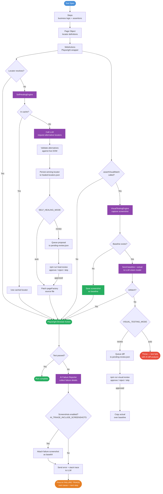

# AI-Assisted Playwright TypeScript Test Automation Framework

A production-grade UI and API test automation framework built with [Playwright](https://playwright.dev/) and TypeScript. It implements the **Page Object Model (POM)** pattern and integrates four AI-powered capabilities: natural language test generation, intelligent failure analysis, self-healing locators, and visual regression testing.

**Applications under test:**
- UI: [https://www.saucedemo.com](https://www.saucedemo.com) — e-commerce demo site
- API: [https://restful-booker.herokuapp.com](https://restful-booker.herokuapp.com) — hotel booking REST API

---

## Table of Contents

- [Prerequisites](#prerequisites)
- [Getting Started](#getting-started)
- [Project Structure](#project-structure)
- [Running Tests](#running-tests)
- [AI Features](#ai-features)
  - [AI-Assisted Test Generation](#1-ai-assisted-test-generation)
  - [Intelligent Failure Analysis](#2-intelligent-failure-analysis)
  - [Self-Healing Locators](#3-self-healing-locators)
  - [AI-Assisted Visual Regression Testing](#4-ai-assisted-visual-regression-testing)
- [Architecture](#architecture)
- [Environment Variables Reference](#environment-variables-reference)

---

## Prerequisites

- [Node.js](https://nodejs.org/) v18 or later
- npm v9 or later
- An [OpenAI API key](https://platform.openai.com/api-keys) *(only required for AI features)*
- [Claude Code](https://claude.ai/code) CLI *(only required for AI-assisted test generation)*

---

## Getting Started

### 1. Clone the repository

```bash
git clone https://github.com/<your-username>/playwright-typescript-demo-framework.git
cd playwright-typescript-demo-framework
```

### 2. Install dependencies

```bash
npm install
npx playwright install --with-deps chromium
```

### 3. Configure environment variables

Copy the example below and create `env/.env.test`:

```bash
# UI test credentials (saucedemo.com)
UI_VALID_USERNAME="standard_user"
UI_VALID_PASSWORD="secret_sauce"
UI_INVALID_USERNAME="invalid_ui_user"
UI_INVALID_PASSWORD="invalid_ui_pass"

# API test credentials (restful-booker.herokuapp.com)
API_VALID_USERNAME="admin"
API_VALID_PASSWORD="password123"
API_INVALID_USERNAME="invalidUser"
API_INVALID_PASSWORD="invalidPass"

# AI Failure Analysis (optional — leave blank to disable)
AI_TRIAGE_ENDPOINT="https://api.openai.com/v1/responses"
AI_TRIAGE_API_KEY="sk-proj-..."
AI_TRIAGE_MODEL="gpt-4o"

# Self-Healing Locators (optional — leave blank to disable)
SELF_HEALING_ENABLED=true
SELF_HEALING_AI_ENDPOINT="https://api.openai.com/v1/responses"
SELF_HEALING_AI_KEY="sk-proj-..."
SELF_HEALING_AI_MODEL="gpt-4o"
SELF_HEALING_PAGE_FACTORY_DIR="tests/ui-tests/pageFactory"
SELF_HEALING_CACHE_PATH="artifacts/self-healing/healed-locators.json"
SELF_HEALING_MODE=review
SELF_HEALING_QUEUE_PATH="artifacts/self-healing/pending-review.json"

# Visual Regression Testing (optional — leave blank to disable)
VISUAL_TESTING_ENABLED=true
VISUAL_TESTING_AI_ENDPOINT="https://api.openai.com/v1/responses"
VISUAL_TESTING_AI_KEY="sk-proj-..."
VISUAL_TESTING_AI_MODEL="gpt-4o"
VISUAL_TESTING_BASELINES_DIR="artifacts/visual-testing/baselines"
VISUAL_TESTING_MODE=review
```

> AI features are optional. Tests run without any API keys — just omit or leave blank the AI-related vars.

### 4. Run the tests

```bash
npm run test:ui   # UI tests
npm run test:api  # API tests
```

---

## Project Structure

```
playwright-typescript-demo-framework/
├── config/
│   ├── playwright.config.ts          # UI test configuration
│   └── playwright.api.config.ts      # API test configuration
├── tests/
│   ├── ui-tests/
│   │   ├── specs/                    # Test cases
│   │   ├── pageFactory/              # Page objects (locators + UI actions)
│   │   ├── steps/                    # Business logic (extends BaseSteps)
│   │   ├── fixtures/pageFixtures.ts  # Playwright fixture extensions
│   │   ├── common/
│   │   │   ├── webActions.ts         # Playwright wrapper (self-healing + visual testing)
│   │   │   ├── self-healing/         # Self-healing locator engine
│   │   │   └── visual-testing/       # AI-assisted visual regression engine
│   │   └── helpers/pa11yHelper.ts    # Accessibility helpers
│   └── api-tests/                    # REST API test cases
├── lib/
│   ├── env.ts                        # Typed env variable loader
│   ├── global-setup.ts               # Global test setup
│   └── reporters/ai-failure-analysis/ # AI triage reporter
├── scripts/
│   ├── review-heals.ts               # Interactive CLI for reviewing healed locators
│   └── review-visuals.ts             # Interactive CLI for reviewing visual diffs
├── artifacts/
│   ├── self-healing/
│   │   ├── healed-locators.json      # Persistent healing cache
│   │   └── pending-review.json       # Locator review queue
│   └── visual-testing/
│       ├── baselines/                # Approved baseline screenshots (*.png)
│       ├── actuals/                  # Current-run screenshots (*.png)
│       └── pending-review.json       # Visual diff review queue
├── docs/
│   └── ai-failure-triage.md
├── prompts/
│   └── ui-test-instructions.md       # AI test generation instructions
└── env/
    └── .env.test                     # Environment variables (not committed)
```

---

## Running Tests

| Command | Description |
|---|---|
| `npm run test:ui` | Run all UI tests (headless) |
| `npm run test:api` | Run all API tests |
| `npm run test:accessibility` | Run accessibility tests only |
| `npm run test:visual` | Run visual regression tests only |
| `npm run test:ui:ai-triage` | UI tests with AI failure analysis enabled |
| `npm run test:api:ai-triage` | API tests with AI failure analysis enabled |
| `npm run heal:review` | Interactively review pending self-healed locators |
| `npm run visual:review` | Interactively review pending visual snapshot diffs |

**Run a specific spec file:**

```bash
npx playwright test tests/ui-tests/specs/checkout.spec.ts --config=config/playwright.config.ts
```

**Run headed (visible browser):**

```bash
npx playwright test --config=config/playwright.config.ts --headed
```

**Authentication:** The `auth.setup.ts` project runs first and saves a login session to `playwright/.auth/userAuth.json`. All subsequent tests reuse this session via Playwright's `storageState` — no per-test login needed.

---

## AI Features

### 1. AI-Assisted Test Generation

Describe what you want to test in plain English and the framework will:

1. Launch a real Chrome browser and perform the manual journey step by step
2. Capture locators and interactions automatically
3. Generate a fully structured TypeScript test following the POM pattern used in this project
4. Run the generated test to verify it passes

**Requirements:** [Claude Code CLI](https://claude.ai/code) installed and authenticated.

**How to use:**

Open your terminal in the project root with Claude Code active, then type:

```
/ui-test verify that a user can add a product to the cart and proceed to checkout
```

Claude Code will:
- Open `https://www.saucedemo.com` in a headed Chrome browser
- Walk through the scenario using `playwright-cli`
- Generate the Page, Steps, Fixture, and Spec files following the project's POM architecture
- Run the new test and report the result

**What gets generated (example for a new feature):**

```
tests/ui-tests/pageFactory/newFeaturePage.ts   ← locators + low-level actions
tests/ui-tests/steps/newFeatureSteps.ts        ← business logic + assertions
tests/ui-tests/fixtures/pageFixtures.ts        ← updated with new fixture
tests/ui-tests/specs/new-feature.spec.ts       ← thin test file
```

The generation prompt is defined in [prompts/ui-test-instructions.md](prompts/ui-test-instructions.md) and enforces the same conventions as the existing codebase.

---

### 2. Intelligent Failure Analysis

When tests fail, an AI reporter automatically analyses each failure and prints a root cause summary directly in the terminal — no manual log digging required.

**How it works:**

1. The custom reporter ([lib/reporters/ai-failure-analysis/](lib/reporters/ai-failure-analysis/)) collects all unexpected failures during the run.
2. At the end of the run it sends each failure to the configured LLM, including:
   - Test title and file location
   - Error message and stack trace
   - Failure screenshot (optional, for visual failures)
3. The model classifies the root cause (selector drift, timing, test data, auth, backend, assertion) and suggests a next debugging step.
4. The analysis is printed as an **AI FAILURE TRIAGE** block in the terminal.

**Enable it:**

```bash
# Runs tests and sends failures to the AI for triage
npm run test:ui:ai-triage
npm run test:api:ai-triage

# Or set the cap manually
AI_TRIAGE_MAX_FAILURES=10 npm run test:ui
```

**Enable screenshot analysis (multimodal models):**

```bash
AI_TRIAGE_INCLUDE_SCREENSHOTS=true npm run test:ui:ai-triage
```

**Required environment variables:**

```env
AI_TRIAGE_ENDPOINT="https://api.openai.com/v1/responses"
AI_TRIAGE_API_KEY="sk-proj-..."
AI_TRIAGE_MODEL="gpt-4o"
AI_TRIAGE_MAX_FAILURES=20                    # optional, default: 20
AI_TRIAGE_INCLUDE_SCREENSHOTS=false          # optional, default: false
```

> If these variables are not set, the reporter falls back to a plain local summary with no AI calls.

---

### 3. Self-Healing Locators

When a UI locator breaks (e.g., a `data-test` attribute is renamed or a CSS class changes), the framework detects the failure at runtime, asks the AI for alternative locators, validates them against the live DOM, and either patches the source file automatically or queues the fix for human review.

**How it works:**

1. Every interaction goes through [WebActions](tests/ui-tests/common/webActions.ts), which wraps Playwright calls.
2. If a locator times out, `WebActions` hands the broken selector and the current page HTML to the [SelfHealingEngine](tests/ui-tests/common/self-healing/SelfHealingEngine.ts).
3. The engine calls the AI (via [SelfHealingClient](tests/ui-tests/common/self-healing/SelfHealingClient.ts)) and receives up to 5 alternative locators with confidence scores.
4. Each alternative is validated against the live DOM.
5. The winning locator is cached to `artifacts/self-healing/healed-locators.json` so it is reused on future runs without another AI call.
6. Depending on `SELF_HEALING_MODE`:
   - **`auto`** — patches the `pageFactory/` source file immediately
   - **`review`** — adds a proposal to `artifacts/self-healing/pending-review.json` for a human to approve

**Review mode workflow:**

```bash
# 1. Run tests — broken locators are queued, not auto-patched
SELF_HEALING_MODE=review npm run test:ui

# 2. Review and approve / reject proposals interactively
npm run heal:review
```

The review CLI shows each proposal with the broken locator, suggested fix, confidence score, reasoning, and source file location. Approved proposals are patched into the source file on the spot.

**Example healed locator (from cache):**

```json
{
  "[data-test=\"ad-to-cart-sauce-labs-backpack\"]": "[data-test=\"add-to-cart-sauce-labs-backpack\"]"
}
```

**Required environment variables:**

```env
SELF_HEALING_ENABLED=true
SELF_HEALING_AI_ENDPOINT="https://api.openai.com/v1/responses"
SELF_HEALING_AI_KEY="sk-proj-..."
SELF_HEALING_AI_MODEL="gpt-4o"
SELF_HEALING_MODE=review                          # "auto" or "review"
SELF_HEALING_PAGE_FACTORY_DIR="tests/ui-tests/pageFactory"
SELF_HEALING_CACHE_PATH="artifacts/self-healing/healed-locators.json"
SELF_HEALING_QUEUE_PATH="artifacts/self-healing/pending-review.json"
```

> Set `SELF_HEALING_ENABLED=false` (or omit the variable) to run without self-healing.

---

### 4. AI-Assisted Visual Regression Testing

Instead of brittle pixel-perfect diffs, the framework sends both the **baseline** and **actual** screenshot to an LLM vision model (`gpt-4o`) and asks it to identify meaningful UI changes — layout shifts, text changes, missing or new elements, colour changes — while ignoring irrelevant rendering noise like sub-pixel anti-aliasing.

**How it works:**

1. A test calls `visualActions.assertVisualMatch('snapshot-name')` via the `visualActions` fixture.
2. [VisualTestingEngine](tests/ui-tests/common/visual-testing/VisualTestingEngine.ts) captures a screenshot of the current page.
3. **First run (no baseline):** the screenshot is saved as the approved baseline under `artifacts/visual-testing/baselines/` and the test passes immediately — no AI call needed.
4. **Subsequent runs:** the baseline and actual screenshot are both sent as `input_image` to the LLM via [VisualTestingClient](tests/ui-tests/common/visual-testing/VisualTestingClient.ts).
5. The model returns a structured JSON result:
   - `isMatch` — whether the pages are visually equivalent
   - `confidence` — 0–100% confidence score
   - `diffRegions` — list of detected changes, each with a description, severity (`minor` / `moderate` / `major`), and approximate location
   - `summary` — one-sentence overview
   - `recommendation` — `pass` / `fail` / `review`
6. Depending on `VISUAL_TESTING_MODE`:
   - **`review`** — detected diffs are queued in `artifacts/visual-testing/pending-review.json`; the test **passes** this run. Run `npm run visual:review` to action each diff.
   - **`auto`** — the test **fails immediately** with the full AI analysis in the error message.

**Running visual regression tests:**

```bash
# Run only visual specs (tagged @visual)
npm run test:visual

# Or include them in the full UI run
npm run test:ui
```

**Review mode workflow:**

```bash
# 1. Run tests — visual diffs are queued, test passes this run
VISUAL_TESTING_MODE=review npm run test:visual

# 2. Review each diff interactively
npm run visual:review
```

The review CLI shows the snapshot name, page URL, AI summary, confidence score, and a full breakdown of detected change regions. For each entry you choose:

- **(a) approve** — copies the actual screenshot over the baseline (accepts the change as the new reference)
- **(r) reject** — marks as rejected so the next run treats it as a confirmed regression
- **(s) skip** — leaves the entry pending for later

**Writing a visual test:**

```typescript
import { test } from '../fixtures/pageFixtures';

test('products page matches baseline', async ({ visualActions }) => {
    await visualActions.navigateTo('/');
    await visualActions.assertVisualMatch('products-page');
});

// Full-page (scrollable content beyond the viewport)
test('products page full scroll matches baseline', async ({ visualActions }) => {
    await visualActions.navigateTo('/');
    await visualActions.assertVisualMatch('products-page-full', { fullPage: true });
});
```

The `visualActions` fixture is a `WebActions` instance pre-wired to the visual testing engine. `assertVisualMatch` is a **no-op** when `VISUAL_TESTING_ENABLED` is not set to `true`, so the tests are safe to commit without requiring an API key in every environment.

**Artefact layout:**

```
artifacts/visual-testing/
├── baselines/
│   ├── products-page.png         ← approved reference screenshots
│   └── cart-page.png
├── actuals/
│   ├── products-page.png         ← screenshots from the latest run
│   └── cart-page.png
└── pending-review.json           ← diffs awaiting human review
```

**Required environment variables:**

```env
VISUAL_TESTING_ENABLED=true
VISUAL_TESTING_AI_ENDPOINT="https://api.openai.com/v1/responses"
VISUAL_TESTING_AI_KEY="sk-proj-..."
VISUAL_TESTING_AI_MODEL="gpt-4o"
VISUAL_TESTING_BASELINES_DIR="artifacts/visual-testing/baselines"   # optional
VISUAL_TESTING_MODE=review                                           # "auto" or "review"
```

> Set `VISUAL_TESTING_ENABLED=false` (or omit the variable) to skip all visual checks without removing the test calls.

---

## Architecture

```
┌─────────────────────────────────────────────────────────────────────────┐
│                             SPEC LAYER                                  │
│              tests/ui-tests/specs/  ·  tests/api-tests/                 │
│        Thin test files — one describe block per feature area.           │
│        Import fixtures only. No locators, no assertions inline.         │
└───────────────────────────────┬─────────────────────────────────────────┘
                                │
┌───────────────────────────────▼─────────────────────────────────────────┐
│                           FIXTURES LAYER                                │
│                 tests/ui-tests/fixtures/pageFixtures.ts                 │
│      Playwright test.extend — wires Steps classes into test context.    │
│                    Pre-authenticated via storageState.                  │
└───────────────────────────────┬─────────────────────────────────────────┘
                                │
┌───────────────────────────────▼─────────────────────────────────────────┐
│                            STEPS LAYER                                  │
│                       tests/ui-tests/steps/                             │
│     Business logic and assertions. Extends BaseSteps, which provides   │
│     all page objects. Each method maps to one test scenario.            │
└───────────────────────────────┬─────────────────────────────────────────┘
                                │
┌───────────────────────────────▼─────────────────────────────────────────┐
│                         PAGE OBJECT LAYER                               │
│                     tests/ui-tests/pageFactory/                         │
│   One class per page/component. Holds locators and low-level UI         │
│   interactions only — no assertions, no business logic.                 │
└───────────────────────────────┬─────────────────────────────────────────┘
                                │
┌───────────────────────────────▼─────────────────────────────────────────┐
│                      WEBACTIONS & AI/ML LAYER                           │
│   tests/ui-tests/common/webActions.ts                                   │
│   common/self-healing/  ·  common/visual-testing/                       │
│                                                                         │
│   WebActions — wraps all Playwright interactions (click, fill,          │
│   select, visibility checks, visual snapshot assertions). Single        │
│   integration point for both AI pipelines.                              │
│                                                                         │
│   SelfHealingEngine — detects broken locators at runtime, calls the     │
│   AI for alternatives, validates against the live DOM, updates          │
│   source files or queues proposals for review.                          │
│                                                                         │
│   VisualTestingEngine — captures page screenshots, sends baseline +     │
│   actual to the LLM vision model, interprets the structured diff        │
│   result, and either fails the test or queues for human review.         │
└───────────────────────────────┬─────────────────────────────────────────┘
                                │
┌───────────────────────────────▼─────────────────────────────────────────┐
│                    CONFIGURATION & REPORTING LAYER                      │
│    config/playwright.config.ts  ·  config/playwright.api.config.ts      │
│    lib/reporters/ai-failure-analysis/  ·  lib/env.ts                    │
│                                                                         │
│   Playwright config — projects, retries, base URLs, storage state.      │
│   AI Failure Reporter — custom Playwright reporter that collects        │
│   failures post-run and sends them to an LLM for root cause triage.     │
│   ENV — typed loader for all credentials and AI config from .env.test.  │
└─────────────────────────────────────────────────────────────────────────┘
```

### Data & Request Flow



---

## Environment Variables Reference

| Variable | Required | Description |
|---|---|---|
| `UI_VALID_USERNAME` | Yes | Valid saucedemo.com username |
| `UI_VALID_PASSWORD` | Yes | Valid saucedemo.com password |
| `UI_INVALID_USERNAME` | Yes | Invalid username for negative tests |
| `UI_INVALID_PASSWORD` | Yes | Invalid password for negative tests |
| `API_VALID_USERNAME` | Yes | Valid restful-booker username |
| `API_VALID_PASSWORD` | Yes | Valid restful-booker password |
| `AI_TRIAGE_ENDPOINT` | No | LLM endpoint for failure analysis |
| `AI_TRIAGE_API_KEY` | No | API key for failure analysis |
| `AI_TRIAGE_MODEL` | No | Model to use (default: `gpt-4o`) |
| `AI_TRIAGE_MAX_FAILURES` | No | Max failures to analyse (default: 20) |
| `AI_TRIAGE_INCLUDE_SCREENSHOTS` | No | Send screenshots to LLM (default: false) |
| `SELF_HEALING_ENABLED` | No | Enable self-healing (default: false) |
| `SELF_HEALING_AI_ENDPOINT` | No | LLM endpoint for locator healing |
| `SELF_HEALING_AI_KEY` | No | API key for locator healing |
| `SELF_HEALING_AI_MODEL` | No | Model to use (default: `gpt-4o`) |
| `SELF_HEALING_MODE` | No | `auto` or `review` (default: `review`) |
| `SELF_HEALING_PAGE_FACTORY_DIR` | No | Path to pageFactory directory |
| `SELF_HEALING_CACHE_PATH` | No | Path for healed locator cache |
| `SELF_HEALING_QUEUE_PATH` | No | Path for locator review queue |
| `VISUAL_TESTING_ENABLED` | No | Enable visual regression testing (default: false) |
| `VISUAL_TESTING_AI_ENDPOINT` | No | LLM endpoint for screenshot comparison |
| `VISUAL_TESTING_AI_KEY` | No | API key for screenshot comparison |
| `VISUAL_TESTING_AI_MODEL` | No | Vision model to use (default: `gpt-4o`) |
| `VISUAL_TESTING_MODE` | No | `auto` or `review` (default: `review`) |
| `VISUAL_TESTING_BASELINES_DIR` | No | Path for baseline screenshots |
